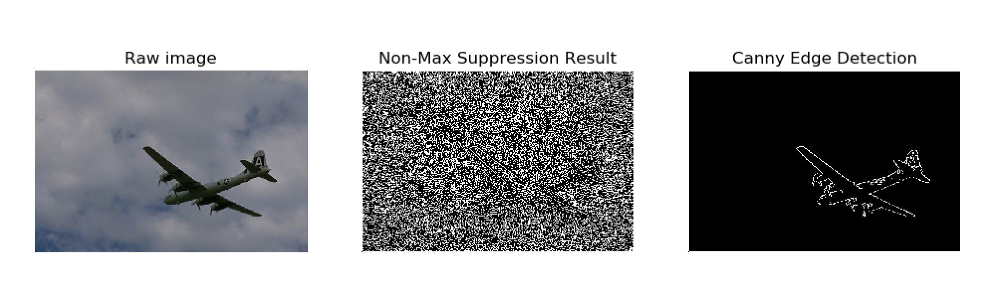
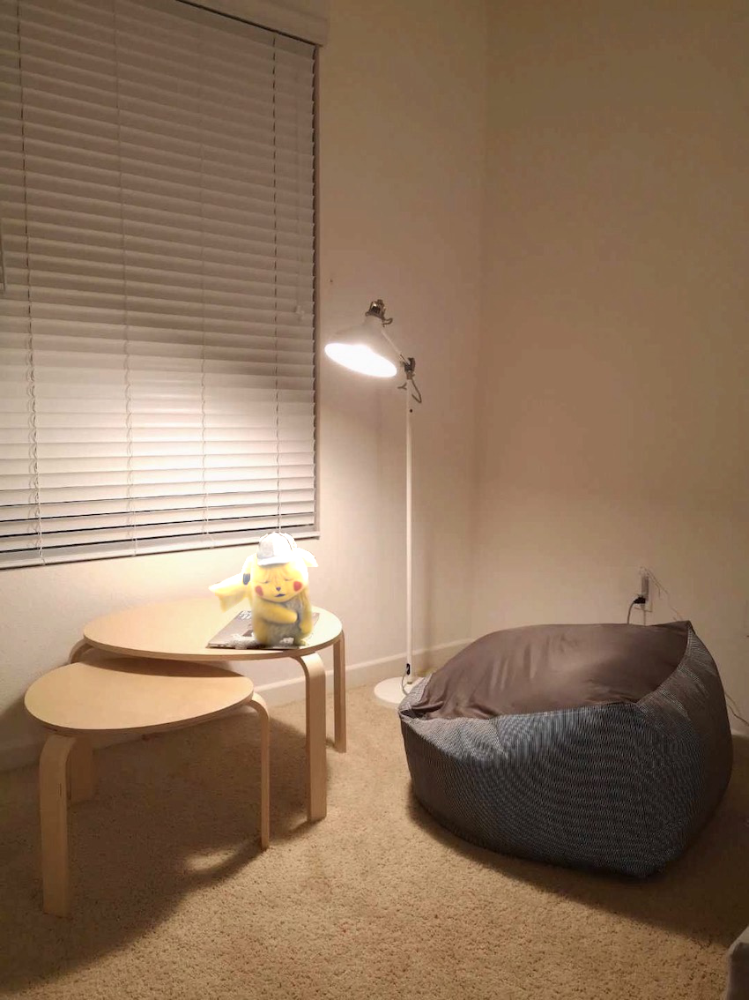
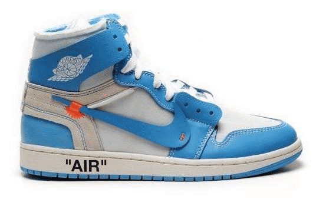

# Image processing algorithms from scratch

## Canny Edge Detection

## Image Gradient Blending
AA Airplane flying over the Golden Gate Bridge. 

Pokemon Detective Pikachu in my bedroom. 

## Image Morphing
Produce a "morph" animation of one's face (or one item) into another person’s face (another item).

## Seam Carving
Implementing image resizing utilizing scene carving.

## Image Stitching

## Optical Flow & Visual Tracking

