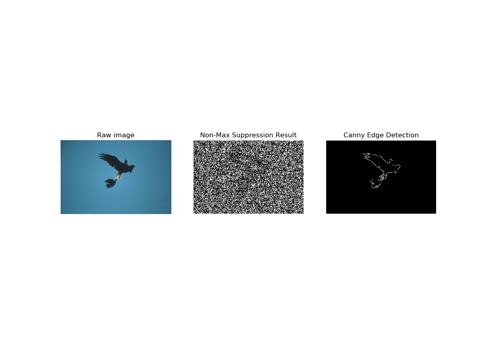
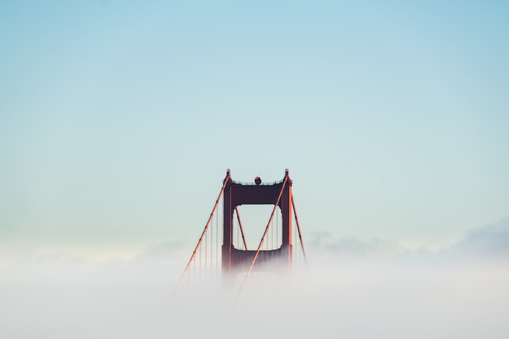

# Image processing algorithms from scratch

## Canny Edge Detection
Compute the Canny Edges for any RGB image.

## Image Gradient Blending
Seamlessly blend an object from a source image into a target image.

## Image Morphing
Produce a "morph" animation of one's face into another person’s face.

## Seam Carving
Implementing image resizing utilizing scene carving.

## Image Stitching

## Optical Flow & Visual Tracking
